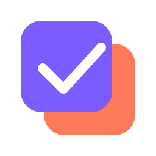

<p align="center">
  
</p>

<h1 align="center">Project Manager</h1>

<p align="center">
  Gerenciador de projetos desktop com IA integrada, importação direta do GitHub e SQLite local.
</p>

<p align="center">
  
  
  
  
  
</p>

---

## Features

- Gerenciamento de projetos com tarefas, notas e progresso
- Importação do GitHub — puxa todos os seus repos com um clique
- IA integrada — Gemini Flash ou modelos locais via Ollama, com histórico de chat por projeto
- Tarefas inteligentes — a IA cria e prioriza tarefas a partir do contexto do projeto
- Chat com contexto — a IA conhece o projeto, tarefas e notas antes de responder
- Descoberta de modelos Ollama — o app lista os modelos já instalados, sem precisar digitar nome
- Recuperação de credenciais — token do GitHub inválido oferece reconfigurar na hora, sem beco sem saída
- Persistência local via SQLite, sem dependência de servidor

## Instalação

```bash
git clone git@github.com:gabfoipego/projectmanager.git
cd projectmanager

pip install -r requirements.txt

python app.py
```

Nenhuma configuração é obrigatória para abrir o app — os campos abaixo são preenchidos direto na interface, em **Configurações**.

## Configuração

Abra o app e vá em **Configurações**:

| Campo | Onde obter |
|---|---|
| GitHub Token | github.com/settings/tokens → New token → scope `repo` |
| Gemini API Key | aistudio.google.com → Get API Key (grátis) |
| Modelo Ollama | instale com `ollama pull <modelo>` — o app lista os modelos instalados automaticamente e deixa escolher |

A `GEMINI_API_KEY` também pode ser definida via `.env` (veja `.env.example`), que tem prioridade sobre o valor salvo em Configurações — útil para não deixar a chave gravada no SQLite local.

## IA — Gemini vs Ollama

| | Gemini Flash | Ollama |
|---|---|---|
| Velocidade | Rápido | Depende do hardware |
| Privacidade | Cloud | 100% local |
| Custo | Grátis (cota generosa) | Grátis |
| Qualidade | Alta | Depende do modelo instalado |

## Uso da IA

A IA tem acesso ao contexto completo do projeto:

- Nome, descrição, linguagem
- Lista de tarefas (pendentes, em progresso, concluídas)
- Notas do projeto
- Progresso geral

Exemplos de prompts:

- *"Crie uma lista de tarefas para implementar autenticação JWT"*
- *"Quais são os próximos passos mais importantes?"*
- *"Revise o status do projeto e me dê um resumo"*

Quando a IA listar tarefas em formato de lista, um botão aparece na conversa para adicioná-las automaticamente ao projeto.

## Estrutura

```
.
├── app.py            # UI principal (CustomTkinter)
├── database.py       # SQLite — projetos, tarefas, notas, chat
├── ai_client.py       # Gemini + Ollama com streaming
├── github_api.py      # GitHub REST API
├── assets/icon.svg    # Marca do app (ícone da janela e da sidebar)
├── requirements.txt
└── .env.example
```

Detalhes de camadas, modelo de dados e fluxo de configuração estão em [architecture.md](architecture.md).

## Licença

MIT
